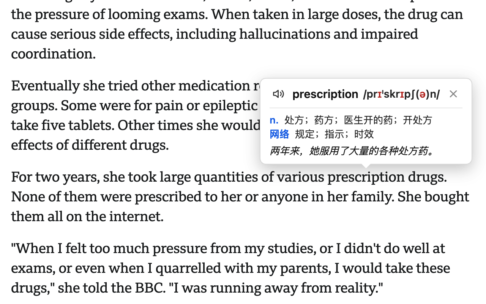

# EchoWord

悬停英文单词即弹出卡片，展示音标、释义与整句中文翻译，并用系统 TTS 朗读——在句子的语感里学会一个词。

> 陌生单词，不读出来就永远学不会。

**安装地址**  
[Chrome扩展商店地址](https://chromewebstore.google.com/detail/echoword/ifjpabfblikdkfgchnhdcplgbpjhoila?hl=zh-CN)  
[Edge 插件商店地址](https://microsoftedge.microsoft.com/addons/detail/echoword/bfnlgfbpacnfaehogfejnkajideodcdg)


**插件截图**  


**视频演示**  
<video src="https://github.com/user-attachments/assets/2786b57e-932e-415f-ab7c-7cde47090451" width="50%" controls></video>

## 功能特性

- **悬停即查**：鼠标移到生词上弹出卡片，移开自动消失，不打断阅读；
- **标准发音**：系统 TTS 清晰朗读单词和整句，可选美式 / 英式音标；
- **在句中学词**：不只看到释义，还能听到、读懂完整句子；
- **可固定卡片**：想仔细研究时把卡片固定住，看完再关；
- **按需生效**：只在英文网页上工作，中文网页不受影响；可对单个网站启停；
- **灵活触发**：悬停、点击、修饰键组合等多种弹窗触发方式（随系统类型显示）；
- **双引擎翻译**：整句翻译可选谷歌或必应。

## 安装（开发者模式）

纯静态 MV3 扩展，无构建、无依赖：

1. 打开 `chrome://extensions`（或 Edge 的 `edge://extensions`）；
2. 打开右上角「开发者模式」；
3. 点击「加载已解压的扩展程序」，选择本项目根目录；
4. 改完 JS/HTML 后，点扩展卡片的刷新按钮，再刷新网页让 content script 重新注入。

打包发布：`bash package.sh`（产物输出到 `dist/EchoWord-<版本>.zip`）。

## 使用

阅读英文网页时，把鼠标悬停到陌生单词上，卡片会弹出音标、释义与整句中文翻译，并按设置朗读。点工具栏图标可快速切换「当前站点 / 全部网站」的启用状态，点「打开完整设置」进入设置页调整语音、语速、触发方式等。

**推荐配置**：在设置里开启「朗读单词」「朗读整句」并勾选「先读单词，再读整句」，遇到生词时先听单词、再听整句，顺势在句子里看懂它的用法。

## 项目结构

```
├── manifest.json          # MV3 清单（权限、content script、options、popup）
├── content.js             # 核心：Shadow DOM 弹窗、悬停状态机、单词识别、消息调用
├── background.js          # MV3 service worker：TTS 朗读、必应词典、整句翻译、消息路由
├── offscreen.js/.html     # 离屏文档：解析必应词典 HTML（SW 无 DOMParser）
├── options.*              # 设置页
├── popup.*                # 工具栏弹窗（站点启停管理）
├── _locales/              # 中英文文案（zh_CN / en）
├── icons/                 # 扩展图标
├── docs/                  # 接口说明、PRD、技术文档
└── package.sh             # 打包脚本
```

## 开发

- 语法检查（改动后必做）：

  ```bash
  node --check content.js background.js options.js popup.js offscreen.js
  ```

- 配置存于 `chrome.storage.local`，content 脚本通过 `chrome.storage.onChanged` 实时应用。
- 消息协议：content → background 的 `type` 为 `speak` / `speakSequence` / `stop` / `lookup` / `translate` / `getVoices`；background → offscreen 为 `parseDictHtml`。

## 文档

- [docs/api.md](docs/api.md) — 谷歌 / 必应翻译免费接口
- [docs/prds/](docs/prds/) — 功能 PRD
- [docs/technical/](docs/technical/) — 悬停状态机、后台窗口误触修复的详细说明

## 权限说明

| 权限 | 用途 |
| --- | --- |
| `tts` | 系统 TTS 朗读单词与整句、枚举语音、停止播放 |
| `storage` | 本地保存设置与词典 / 翻译缓存 |
| `offscreen` | 离屏文档解析必应词典 HTML |
| `activeTab` | 识别当前标签页以控制注入 |
| `host_permissions` | 访问必应词典与谷歌 / 必应翻译接口 |
